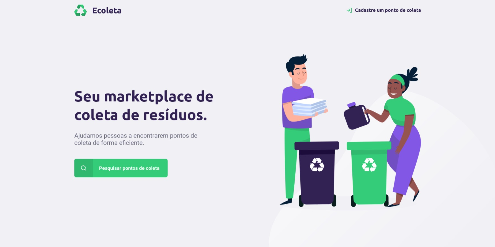
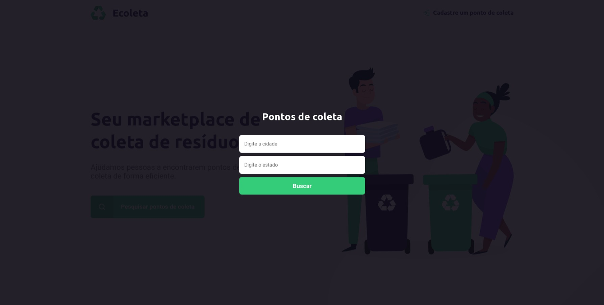

<div align="center"></div>

<div>
  <h1 align="center">Em desenvolvimento</h1>

  <h3 align="center">Projeto criado com base no layout disponibilizado na 1ª NLW pela <a href="https://www.rocketseat.com.br">Rocketseat</a></h3>
  <p align="center">App com objetivo de facilitar a localização dos centros de coleta de resíduos</p>
  <br/>
</div>

---

## Prévia




---
## Tecnologias
#### Esse projeto está sendo desenvolvido com as seguintes tecnologias:

- JavaScript
- ReactJS
- React Modal
- React Router
- SASS
- CSS Modules
---
## Instalação

#### Esse projeto usa Node.js e Yarn
- clone o projeto:
  ```
  git clone https://github.com/paulopbomfim/nlw1-ecoleta.git
  ```
- Entre na pasta do projeto usando o terminal e digite:
  ```
  yarn
  ```
- Em seguida digite:
  ```
  yarn start
  ```
